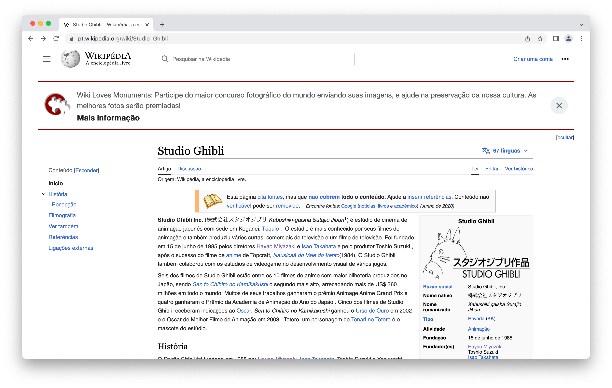

# Web Scraping  - Studio Ghibli, na Wikipédia

### Script

`script_ghibli.R`

### Resultados

`result/`

### Software

R, 4.3.0 version, under IDE RStudio

Fundado em 1985 pelos cineastas japoneses Hayao Miyazaki, Isao Takahata, Toshio Suzuki e Yasuyoshi Tokuma, o Studio Ghibli é um dos estúdios de animação japonesa mais famosos ao redor do mundo. Além de serem reconhecidos pelos traços e cores muito singulares de seus personagens e cenários, os filmes, curtas e comercias do Studio Ghibli são muito aclamados pela crítica e pelo público devido, principalmente, à sensibilidade dos temas que cerceiam suas histórias e à maneira como elas são contadas para nós. Por isso tudo, que tal "scrapear" (ou raspar) a página do Studio Ghibli, na Wikipédia, a maior enciclopédia colaborativa web do mundo, e coletar os dados de todos os filmes já lançados por esse estúdio de cinema? Scrapers e Ghibli-fãs, uni-vos!

 

